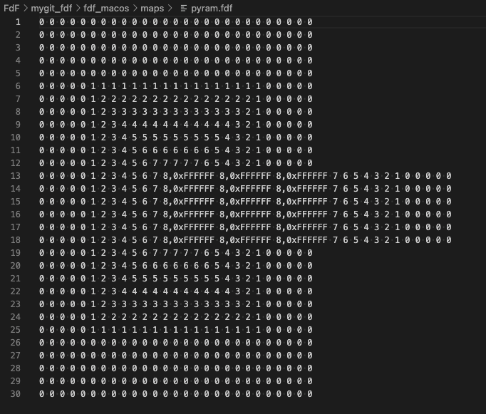
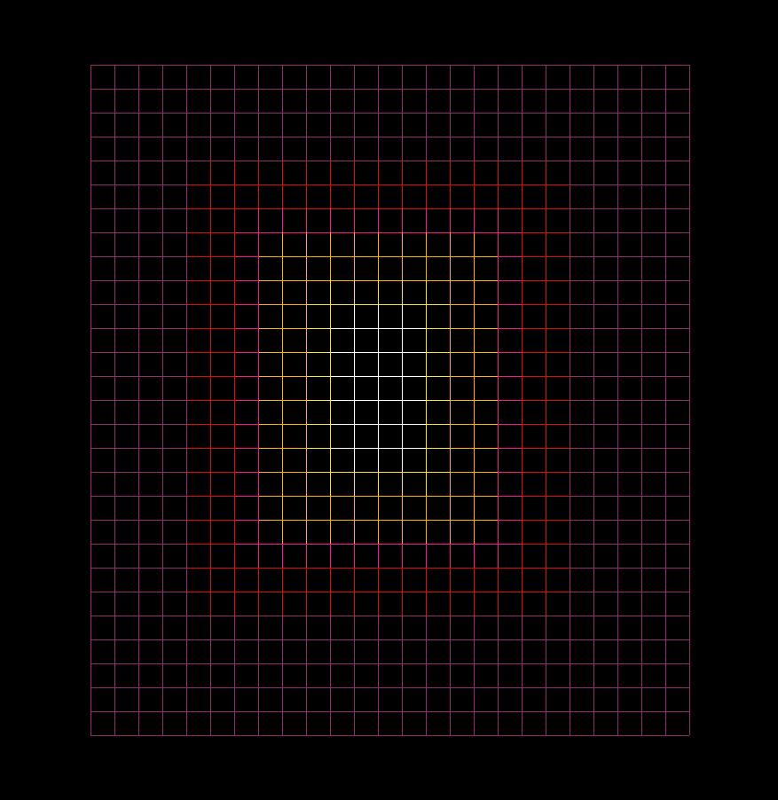
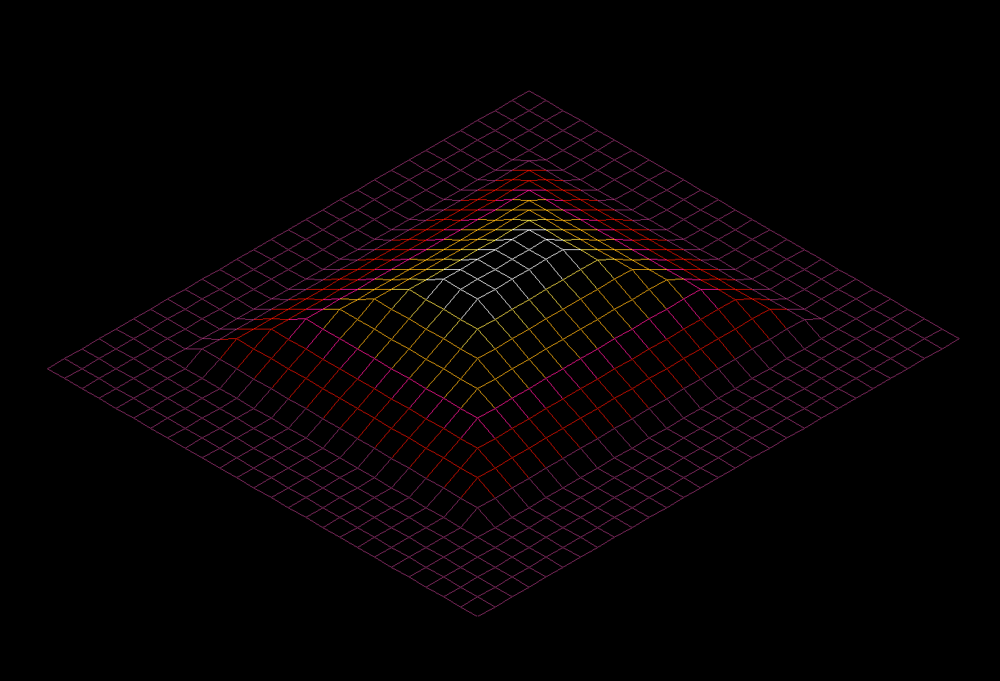
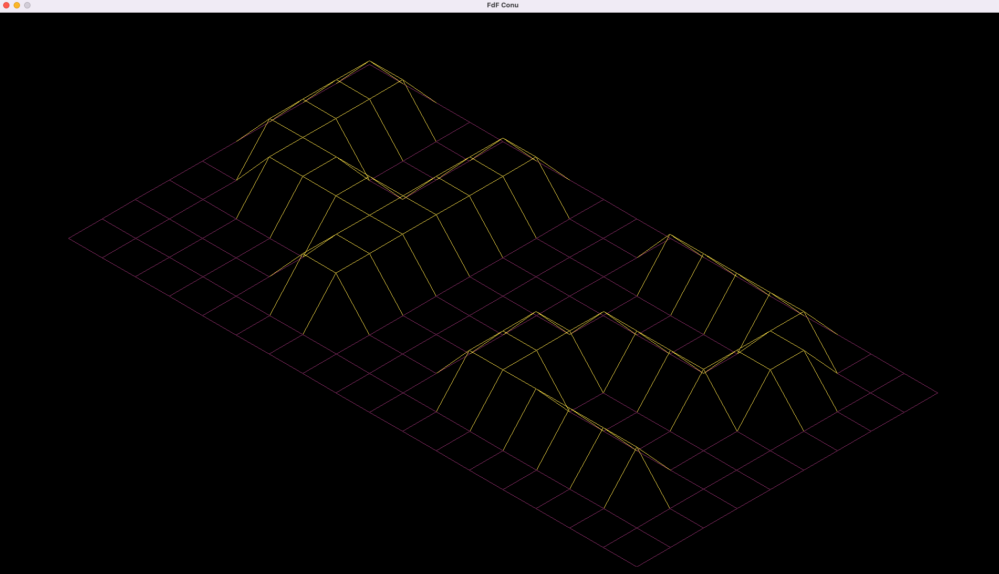
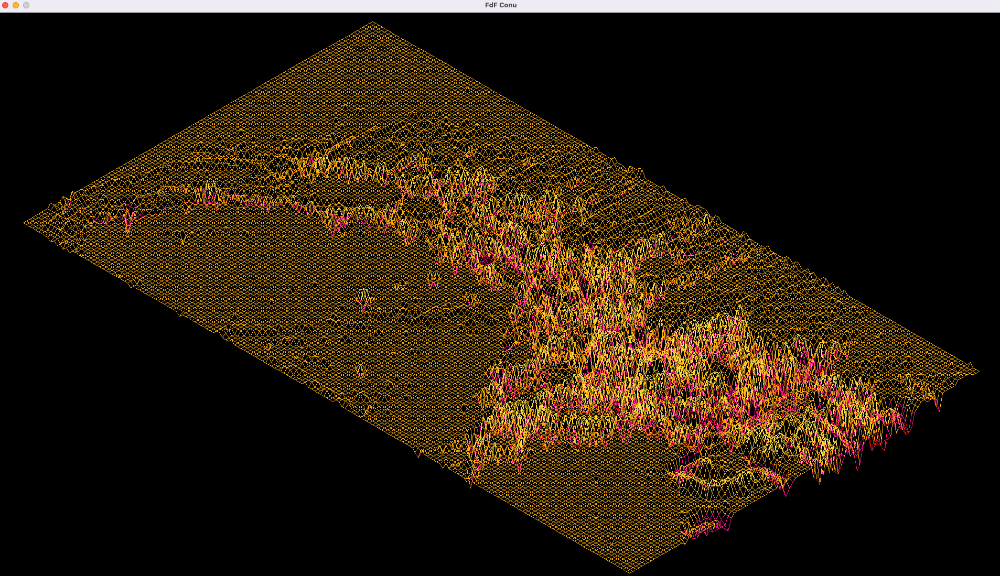

  <a name="readme-top"></a>

<!-- PROJECT LOGO -->
<br />
<div align="center">
  <a href="https://github.com/conu101/FdF">
    
  </a>

  <h3 align="center">FdF | initial graphics project</h3>

  <p align="center">
    <br />
    <br /> 42 Helsinki: basics of graphic programming with the school internal graphics library minilibx.
  </p>
  <br />
  <br />
  <br />
  <br />
</div>


<!-- TABLE OF CONTENTS -->
<details>
  <summary>Table of Contents</summary>
  <ol>
    <li>
      <a href="#about-the-project">About The Project</a>
      <ul>
        <li><a href="#built-with">Built With</a></li>
      </ul>
    </li>
    <li>
      <a href="#getting-started">Getting Started</a>
      <ul>
        <li><a href="#installation">Installation</a></li>
      </ul>
    </li>
    <li><a href="#usage">Usage</a></li>
    <li><a href="#roadmap">Roadmap</a></li>
    <li><a href="#contact">Contact</a></li>
    <li><a href="#acknowledgments">Acknowledgments</a></li>
  </ol>
</details>


<!-- ABOUT THE PROJECT -->
## About The Project

  <a href="https://github.com/conu101/FdF">
    
  </a>

The goal of this project is to discover the basics of graphic programming, and in particular how to place points in space, how to join them with segments and most importantly how to observe the scene from a particular viewpoint.

The result must be displayed via the graphics interface and associated library minilibx, the 42 school equivalent to SDL.

Let's open a window, light a pixel and deal with events linked to this window and we're good to go!


The program accepts text file as argument with the following format:

all lines must have same width
all columns must have same height
each point of the map is defined by an integer whose value determines the altitude of the point.

Points are linked via colored links on 5 levels of relative altitude:

0% --- 20% --- 40% --- 60% --- 80% --- 100%.  
 violet --- red   ---    pink  ----   orange  ----  yellow

For example the following file describing a pyramide:

<a href="https://github.com/conu101/FdF">
    
</a>

note that the points of altitude "8" are also hardcoded to be white independantly of their altitude. The rest of the points will be colorcoded based off their value:

Resut in parallel projection:

<a href="https://github.com/conu101/FdF">
    
</a>

and in isometric projection (switch with keypress I/P between projections during execution):

<a href="https://github.com/conu101/FdF">
    
</a>

The main steps to succeed in the FdF project were:

interpersonal: 
* it was a solo project with a steep learning curve so the time organization was crucial
* I was not yet comfortable with the graphical interface commands, in particular the management of events, during this project but the next project consolidified my newly acquired skills.

technical:
* reading the parameter files, managing error input to avoid segmentation fault
* parsing the input into matrixes
* optimizing the visibility of the drawing (centered on screen, vivid colors, scaling of the altitude).
* first steps with the graphical library and events managements kept to a minimum: keypress control to switch projection mode.

This project unlocked my interest for graphics. I particularly enjoyed the debugging phase with a visual feedback, which was a very different way to look at a project compared with pure algo projects.


### Built With

* [![C][C.js]][C-url]
* [![VS-Code][VS-Code.js]][VSCode-url]
* [![minilibx][minilibx.js]][minilibx-url]


<!-- GETTING STARTED -->
## Getting Started

The project can be set up locally by downloading or cloning the repository. It has been built on and for macos so its functionality is not guaranteed on other operating systems.

The project required the use of the static library libft.a coded during the previous project. The libft version used in this projct is the version I had put together in that time, much more limited than the currently available version that has been updated since.
See libft project -> [https://github.com/conu101/libft](https://github.com/conu101/libft)

The graphics library minilibx is included in this repository (macos version) and will be compiled with the project by the makefile.

The executable "fdf" is available in this repo for direct use, but the project can also be recompiled following the steps presented next. If you use the available executable from this repo, ignore steps 4 and 5.

### Installation

1. Open a terminal on your machine

2. Clone the repo
   ```sh
   git clone https://github.com/conu101/FdF.git <your_local_repository>
   ```
3. Get in your new repository
   ```sh
   cd <your_local_repository>
   ```
4. Compile the project using the Makefile
   ```sh
   make
   ```
5. Check that the executable <fdf> was created and delete the object files
   ```sh
   make clean
   ```
6. Run the executabe with one of the provided maps as argument 
	```sh
	./fdf maps/42.fdf
	```
<p align="right">(<a href="#readme-top">back to top</a>)</p>


<!-- USAGE EXAMPLES -->
## Usage

	```sh
	user@usermachine fdf_git % ./fdf maps/42.fdf
	```

Resut in isometric projection:

<a href="https://github.com/conu101/FdF">
    
</a>

More complex files can be processed, for example the map <mars> presenting a section of the planet surface:

<a href="https://github.com/conu101/FdF">
    
</a>

All files added in the maps folder can be tried, and new maps can be imagined as well, have fun!

<!-- ROADMAP -->
## Roadmap

- [x] Open window and draw a pixel with minilibx
- [x] read and parse the maps
- [x] colorcode the lines between points depending on their relative altitude
    - [x] in parallel view
    - [x] switch to isometric view via keypress event I / P


<!-- CONTACT -->
## Contact

Constance Trouvé - firstname.name(at)gmail.com

Project Link: [https://github.com/conu101/FdF](https://github.com/conu101/FdF)


<!-- ACKNOWLEDGMENTS -->
## Acknowledgments

Illustrations obtained from "The Noun Project", credits:
* "net" by Adrien Coquet from <a href="https://thenounproject.com/browse/icons/term/net/" target="_blank" title="net Icons">Noun Project</a>

* "graphics" by WEBTECHOPS LLP from <a href="https://thenounproject.com/browse/icons/term/graphics/" target="_blank" title="graphics Icons">Noun Project</a>

"C", "VSCode" and "mlx" badges from <a href="https://img.shields.io" target="_blank" title="badges">img.shields.io</a>

README template by Othneil DREW from <a href=https://github.com/othneildrew/Best-README-Template target="_blank" title="git">Git_README_template</a>

<p align="right">(<a href="#readme-top">back to top</a>)</p>


<!-- MARKDOWN LINKS & IMAGES -->
<!-- https://www.markdownguide.org/basic-syntax/#reference-style-links -->
[contributors-shield]: https://img.shields.io/github/contributors/othneildrew/Best-README-Template.svg?style=for-the-badge
[contributors-url]: https://github.com/othneildrew/Best-README-Template/graphs/contributors
[forks-shield]: https://img.shields.io/github/forks/othneildrew/Best-README-Template.svg?style=for-the-badge
[forks-url]: https://github.com/othneildrew/Best-README-Template/network/members
[stars-shield]: https://img.shields.io/github/stars/othneildrew/Best-README-Template.svg?style=for-the-badge
[stars-url]: https://github.com/othneildrew/Best-README-Template/stargazers
[issues-shield]: https://img.shields.io/github/issues/othneildrew/Best-README-Template.svg?style=for-the-badge
[issues-url]: https://github.com/othneildrew/Best-README-Template/issues
[license-shield]: https://img.shields.io/github/license/othneildrew/Best-README-Template.svg?style=for-the-badge
[license-url]: https://github.com/othneildrew/Best-README-Template/blob/master/LICENSE.txt
[linkedin-shield]: https://img.shields.io/badge/-LinkedIn-black.svg?style=for-the-badge&logo=linkedin&colorB=555
[linkedin-url]: https://linkedin.com/in/othneildrew
[product-screenshot]: images/screenshot.png
[C.js]: https://img.shields.io/badge/C--programming-C-blue
[C-url]: https://www.w3schools.com/c/c_intro.php
[VS-Code.js]: https://img.shields.io/badge/Visual%20Studio%20Code-VSC-blue
[VSCode-url]: https://code.visualstudio.com/
[minilibx.js]: https://img.shields.io/badge/mlx-MiniLibX-orange
[minilibx-url]: https://harm-smits.github.io/42docs/libs/minilibx
